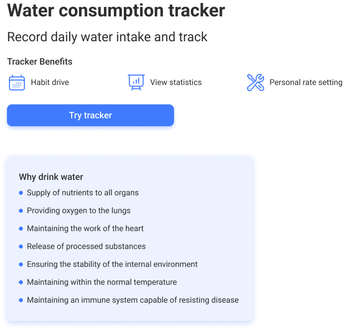

**Читати на інших мовах:: [Англійська](README.md), [Українська](README.ua.md).**

# Додаток Byte My Water


## Опис

Додаток Byte My Water - це сучасний веб-додаток, призначений для ефективного
управління споживанням води та пов'язаними завданнями. Додаток надає
користувачам зручний інтерфейс для відстеження їх використання води,
встановлення цілей та отримання сповіщень. Чи ви власник будинку, бізнесу, або
просто стурбовані збереженням води, Byte My Water допоможе вам ефективно
управляти своїм споживанням води.



## Використані технології

- **Frontend**:
  - React: бібліотека для створення інтерфейсів користувача.
  - React Router: Бібліотека маршрутизації для React-застосунків.
  - Material-UI: Популярний React UI-фреймворк для створення реагуючих
    веб-застосунків.
  - Styled Components: Бібліотека CSS-in-JS для стилізації компонентів React.
  - Axios: Клієнт HTTP на основі обіцянок для здійснення AJAX-запитів.
  - React Hook Form: Бібліотека для керування станом форм у застосунках React.
  - Redux Toolkit: Утиліта Redux для ефективної розробки Redux.
  - React Redux: Офіційні прив'язки React для Redux.
  - React Responsive: Бібліотека для створення адаптивних застосунків React.
  - React Select: Гнучкий і красивий вибір контролю для ReactJS.
  - React DatePicker: Простий і повторно використовуваний компонент вибору дати
    для React.
  - React Toastify: Бібліотека сповіщень для React-застосунків.
  - i18next: Могутній фреймворк інтернаціоналізації для JavaScript.
- **Backend**:
  - "https://byte-water-back.onrender.com/api-docs"
- **Інструменти збірки**:
  - Vite: Швидкий інструмент збірки, який значно поліпшує досвід розробки на
    фронтенді.
- **Лінтування та форматування**:
  - ESLint: Інструмент для ідентифікації та звітування про шаблони, що знайдені
    в коді ECMAScript/JavaScript code.
  - Prettier: Суб'єктивний форматер коду.

## Інсталяція

1. Клонуйте репозиторій:

```bash
   git clone https://github.com/Elizabethhub/byte-my-water-app.git
```

2. Перейдіть до директорії проекту:

```bash
cd byte-my-water-app
```

3. Встановіть залежності:

```bash
npm install
```

4. Запустіть сервер розробки:

```bash
npm run dev
```

5. Відкрийте свій браузер та перейдіть за посиланням http://localhost:5173, щоб
   переглянути додаток.

## Використання

- Під час запуску додатка користувачам пропонується зареєструватися або увійти.
- Після входу користувачі можуть:
  - Переглядати статистику свого споживання води.
  - Встановлювати цілі споживання води.
  - Отримувати сповіщення щодо використання води.
  - Виконувати різноманітні інші завдання, пов'язані з управлінням водою.

## Команда розробників

- [Єлизавета Куделя](https://github.com/Elizabethhub) - Fullstack
  Developer/розробник/керівник команди, модуль Норми модальної частини
- [Олег Ополонець](https://github.com/Olegopolonets) - Fullstack розробник/Скрам
  майстер, модуль Сьогодні та Календар
- [Дмитро Примаченко](https://github.com/DmytroPrymachenko) - Fullstack
  розробник, модулі вітальної сторінки та заголовка, Мови, Теми
- [Кіра Потєхіна](https://github.com/Kirra-acc) - Fullstack розробник, модулі
  модальних вікон додавання/редагування
- [Віктор Філінович](https://github.com/VictorFil67) - Fullstack розробник,
  модуль налаштувань користувача
- [Єгор Григорцев](https://github.com/Goldenrash-lab) - Fullstack розробник,
  модуль авторизації
- [Анастасія Фарафонова](https://github.com/AsyaDev14) - Fullstack розробник,
  макет головної сторінки

## Внесок

Ми вітаємо внесок від спільноти! Якщо ви знайшли будь-які помилки або маєте
пропозиції щодо покращень, будь ласка, не соромтеся відкривати проблему або
надсилати запит на злиття.

## Ліцензія

Цей проект ліцензується на умовах [MIT License](link_to_license_file).
